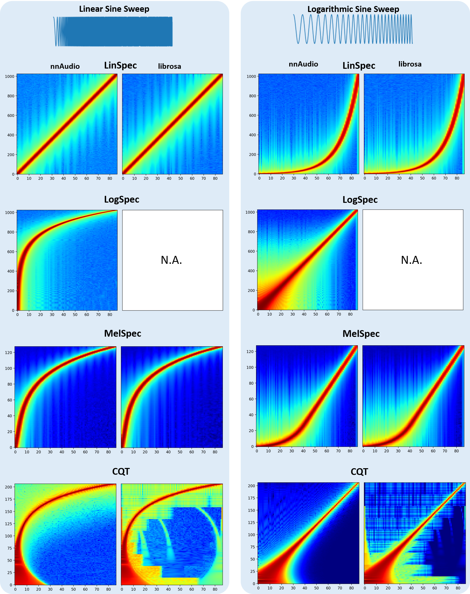
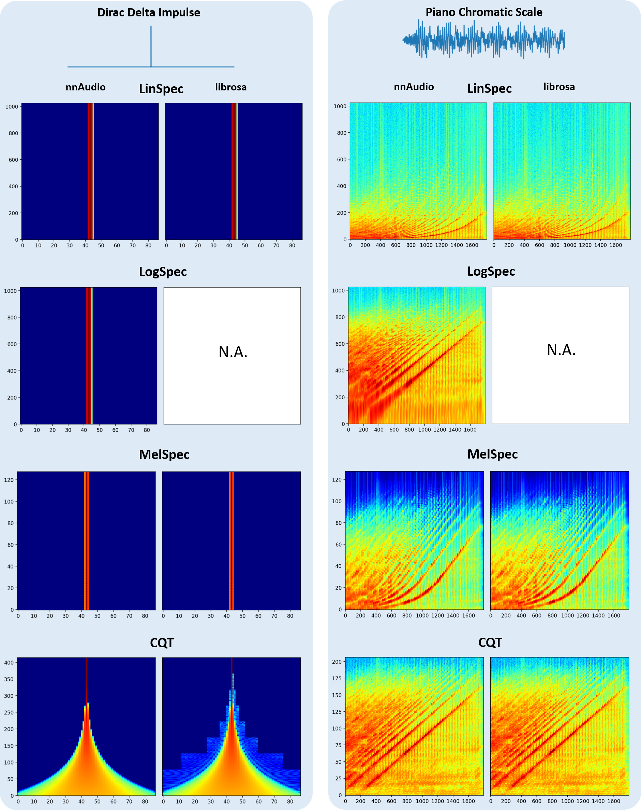
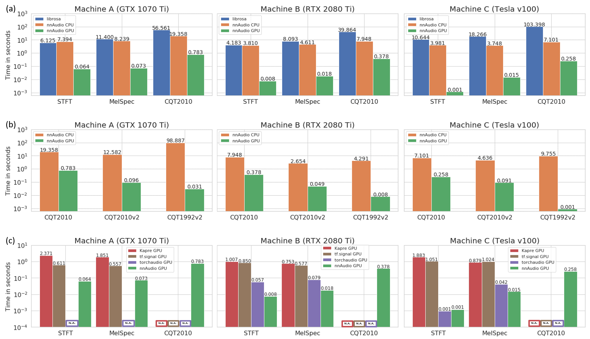
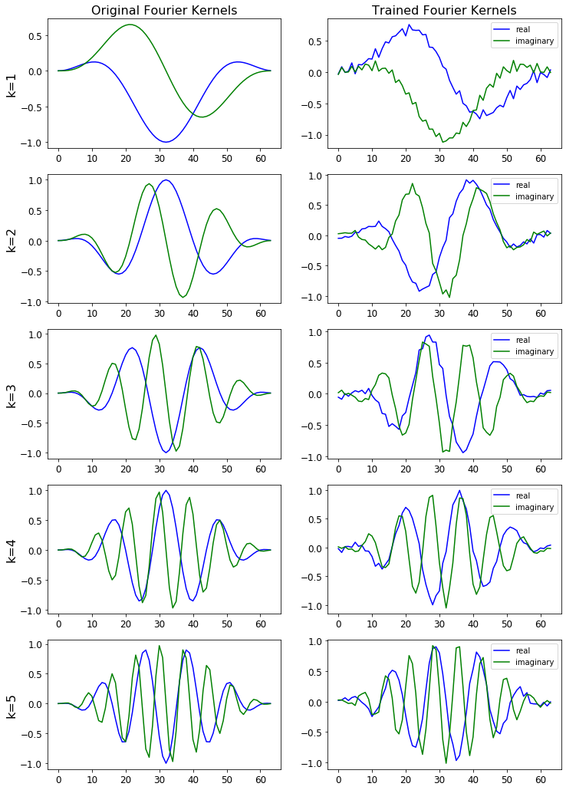
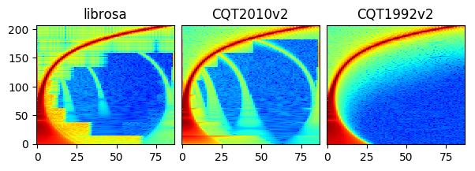

Introduction
============

nnAudio2 implements audio feature extraction as differentiable PyTorch ``nn.Module`` layers.
Transforms such as STFT, Mel spectrogram, MFCC, CQT, VQT, and Gammatone run on GPU (CUDA
or MPS) or CPU and can be embedded directly inside a neural network. Because the kernels are
``nn.Parameter`` tensors, filter banks can optionally be made **trainable** — optimised
end-to-end alongside the rest of the model.

The figure below compares spectrograms produced by nnAudio2 and librosa for the same input.

Installation
============

Via PyPI
--------

.. code-block:: bash

    pip install nnaudio2

Via GitHub
----------

.. code-block:: bash

    pip install git+https://github.com/AMAAI-Lab/nnAudio2.git#subdirectory=Installation

Or install manually:

1. ``git clone https://github.com/AMAAI-Lab/nnAudio2.git``
2. ``cd nnAudio2/Installation``
3. ``pip install .``

Requirements
============

- Python ≥ 3.11
- PyTorch ≥ 2.0
- NumPy ≥ 1.14.5
- SciPy ≥ 1.2.0

Usage
=====

Standalone
----------

Import the specific transform you need and initialise it like any other ``nn.Module``.
The input shape is ``(batch, samples)``.

.. code-block:: python

    import torch
    import torchaudio
    from nnAudio2.features.mel import MelSpectrogram

    waveform, sr = torchaudio.load('audio.wav')      # [channels, samples]
    waveform = waveform.mean(0, keepdim=True)         # mono, [1, samples]

    mel = MelSpectrogram(sr=sr, n_fft=1024, hop_length=512, n_mels=128)
    spec = mel(waveform)                              # [1, 128, T]

For an STFT:

.. code-block:: python

    from nnAudio2.features.stft import STFT

    stft = STFT(n_fft=2048, hop_length=512, freq_scale='no', sr=22050,
                output_format='Magnitude')
    spec = stft(waveform)

.. _on-the-fly:

On-the-fly processing inside a neural network
---------------------------------------------

Because nnAudio2 transforms are standard ``nn.Module`` objects, they can be placed
anywhere in a model. The transform moves to the correct device automatically when
you call ``model.to(device)``.

.. code-block:: python
    :emphasize-lines: 8-12

    import torch
    import torch.nn as nn
    from nnAudio2.features.mel import MelSpectrogram

    class KeywordSpotter(nn.Module):
        def __init__(self, n_mels=64, output_dim=12):
            super().__init__()
            self.mel = MelSpectrogram(
                sr=16000, n_fft=480, hop_length=160,
                n_mels=n_mels, fmin=0.0, norm=1,
                trainable_mel=True, trainable_STFT=True,
            )
            self.classifier = nn.Linear(n_mels * 101, output_dim)

        def forward(self, x):                       # x: [B, 16000]
            spec = torch.log(self.mel(x) + 1e-10)  # [B, n_mels, T]
            return self.classifier(spec.flatten(1))

    model = KeywordSpotter().to('cuda')
    audio = torch.randn(8, 16000).to('cuda')
    logits = model(audio)                           # [8, 12]

The model accepts raw waveforms directly; the spectrogram is computed on-the-fly
during the forward pass.

Using GPU
---------

All transforms support ``.to(device)`` exactly like any other PyTorch module.

.. code-block:: python

    mel = MelSpectrogram(sr=22050, n_fft=1024, hop_length=512, n_mels=128).to('cuda')

On Apple Silicon, use ``device='mps'`` instead.

Speed
=====

The speed test below was conducted on three different machines, demonstrating that
nnAudio2 running on GPU outperforms most existing audio processing libraries.

- **Machine A** — Windows desktop, Intel Core i7-8700 @ 3.20 GHz, GeForce GTX 1070 Ti 8 GB
- **Machine B** — Linux desktop, AMD Ryzen 7 PRO 3700, GeForce RTX 2080 Ti 11 GB
- **Machine C** — DGX station, Intel Xeon E5-2698 v4 @ 2.20 GHz, Tesla V100 32 GB

Trainable kernels
=================

STFT, Mel, and CQT kernels can all be made trainable. Pass ``trainable=True`` to
:func:`~nnAudio2.features.stft.STFT`, or ``trainable_mel=True`` / ``trainable_STFT=True``
to :func:`~nnAudio2.features.mel.MelSpectrogram`, or ``trainable=True`` to
:func:`~nnAudio2.features.cqt.CQT`.

Step-by-step walkthroughs are available in the ``tutorials/`` folder of the repository:

- **Part 1** — computing Mel spectrograms with nnAudio2
- **Part 2** — training a linear keyword spotter with trainable basis functions
- **Part 3** — evaluating the model and visualising learned kernels
- **Part 4** — replacing the linear classifier with a BC-ResNet

The figure below shows the STFT basis before and after training.

The figure below shows how the STFT output is affected by changes to the learned basis.
Notice the subtle difference for the trained STFT.

CQT variants
============

``CQT1992v2`` (the default) computes the CQT directly in the time domain without
transforming both the input and the kernels to the frequency domain, making it faster
than the original 1992 algorithm.

``CQT2010`` uses the downsampling approach from the 2010 paper — the same algorithm
as librosa — and produces similar artefacts as a result.

For more detail, see the `paper <https://ieeexplore.ieee.org/document/9174990>`_.
All CQT variants are accessible via :ref:`CQT API <nnAudio2.features.cqt.CQT>`.

